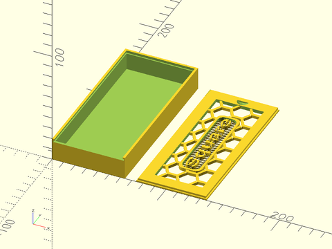
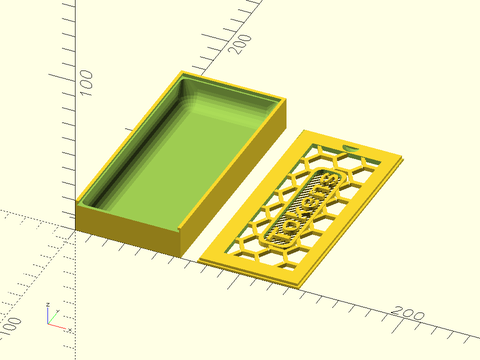
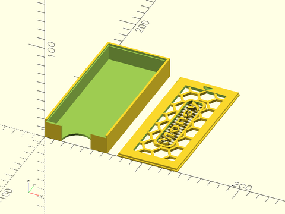
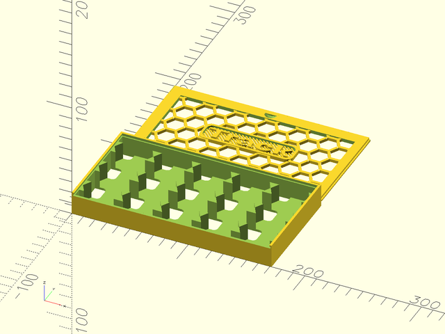
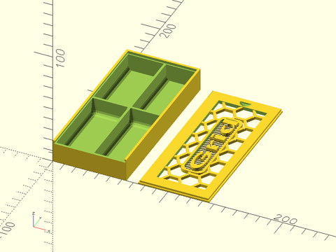
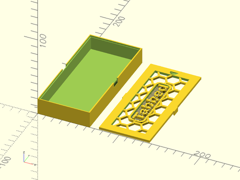
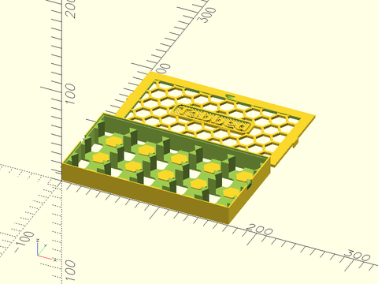

# Create simple boxes with simple cutouts.

- [Create simple boxes with simple cutouts.](#create-simple-boxes-with-simple-cutouts)
  - [Sliding boxes](#sliding-boxes)
    - [Simple box](#simple-box)
    - [Simple box, rounded cutout](#simple-box-rounded-cutout)
    - [Simple Box with finger cutout](#simple-box-with-finger-cutout)
    - [Hex box sliding lid](#hex-box-sliding-lid)
    - [Simple box with 2x2 compartments](#simple-box-with-2x2-compartments)
  - [Tabbed Boxes](#tabbed-boxes)
    - [Simple tabbed box](#simple-tabbed-box)
    - [Tabbed hex box](#tabbed-hex-box)


## Sliding boxes

### Simple box

Create a sliding lid box with a cut of the entire inside of the box.   This also makes the matching sliding
lid.

```openscad
include <boardgame_toolkit.scad>

money_thickness = 10;
money_length = 134;
money_width = 60;
wall_thickness = 2;

money_section_width = money_width + wall_thickness * 2;
money_section_length = money_length + wall_thickness * 2;
top_section_height = 20;

module SquareBox()
{
    MakeBoxWithSlidingLid(width = money_section_width, length = money_section_length, height = top_section_height)
    {
        translate([ wall_thickness, wall_thickness, wall_thickness ])
            cube([ money_width, money_length, top_section_height ]);
    }
    text_str = "Square";
    text_width = 80;
    text_length = 20;
    translate([ money_section_width + 10, 0, 0 ]) SlidingBoxLidWithLabel(
        width = money_section_width, length = money_section_length, text_width = text_width,
        text_length = text_length, text_str = text_str, label_rotated = true);
}

SquareBox();

```


### Simple box, rounded cutout

```openscad
include <boardgame_toolkit.scad>

money_thickness = 10;
money_length = 134;
money_width = 60;
wall_thickness = 2;

money_section_width = money_width + wall_thickness * 2;
money_section_length = money_length + wall_thickness * 2;
top_section_height = 20;

module TokensBox()
{
    MakeBoxWithSlidingLid(width = money_section_width, length = money_section_length, height = top_section_height)
    {
        translate([ wall_thickness, wall_thickness, wall_thickness ])
            RoundedBoxAllSides(width = money_section_width - wall_thickness * 2, length = money_section_length - wall_thickness * 2, height = top_section_height, radius = 10);
    }
    text_str = "Tokens";
    text_width = 80;
    text_length = 20;
    translate([ money_section_width + 10, 0, 0 ]) SlidingBoxLidWithLabel(
        width = money_section_width, length = money_section_length, text_width = text_width,
        text_length = text_length, text_str = text_str, label_rotated = true);
}

TokensBox();

```


### Simple Box with finger cutout

Create a sliding lid box with a cut of the entire inside of the box, adding in a finger cutout to access the cards.  
This also makes the matching sliding lid.

```openscad
include <boardgame_toolkit.scad>

money_thickness = 10;
money_length = 134;
money_width = 60;
wall_thickness = 2;

money_section_width = money_width + wall_thickness * 2;
money_section_length = money_length + wall_thickness * 2;
top_section_height = 20;

module MoneyBox()
{
    difference()
    {
        MakeBoxWithSlidingLid(width = money_section_width, length = money_section_length, height = top_section_height)
        {
            translate([ wall_thickness, wall_thickness, wall_thickness ])
                cube([ money_width, money_length, top_section_height ]);
        }
        translate([ money_section_width / 2, 1, -1 ]) cyl(h = top_section_height * 3, r = 15);
    }
    text_str = "Money";
    text_width = 80;
    text_length = 20;
    translate([ money_section_width + 10, 0, 0 ]) SlidingBoxLidWithLabel(
        width = money_section_width, length = money_section_length, text_width = text_width,
        text_length = text_length, text_str = text_str, label_rotated = true);
}

MoneyBox();

```


### Hex box sliding lid

This creates a hex box bounded by the size of the hexes themselves.

```openscad
include <boardgame_toolkit.scad>

hex_section_height = 20;
tile_width = 29;

module HexBox()
{
    MakeHexBoxWithSlidingLid(rows = 5, cols = 3, tile_width = tile_width, height = hex_section_height, push_block_height = 1);
    text_str = "Track";
    text_width = 80;
    text_length = 20;
    translate([0, 3 * tile_width + 10, 0])
        SlidingLidWithLabelForHexBox(rows = 5, cols = 3, tile_width = tile_width, 
            text_width = text_width, text_length = text_length, text_str = text_str);
}

HexBox();
```


### Simple box with 2x2 compartments

Creates a box with a 2x2 grid compartments.

```openscad
include <boardgame_toolkit.scad>

money_thickness = 10;
money_length = 134;
money_width = 60;
wall_thickness = 2;

money_section_width = money_width + wall_thickness * 2;
money_section_length = money_length + wall_thickness * 2;
top_section_height = 20;

module GridBox()
{
    MakeBoxWithSlidingLid(width = money_section_width, length = money_section_length, height = top_section_height)
    {
        translate([ wall_thickness, wall_thickness, wall_thickness ])
            RoundedBoxGrid(width = money_section_width, length = money_section_length, 
                height = top_section_height, rows = 2, cols = 2, radius = 4, all_sides = true);
    }
    text_str = "Grid";
    text_width = 80;
    text_length = 20;
    translate([ money_section_width + 10, 0, 0 ]) SlidingBoxLidWithLabel(
        width = money_section_width, length = money_section_length, text_width = text_width,
        text_length = text_length, text_str = text_str, label_rotated = true);
}

GridBox();

```


## Tabbed Boxes

### Simple tabbed box

Create a tabbed lid box with a cut of the entire inside of the box.   This also makes the matching tabbed
lid.

```openscad
include <boardgame_toolkit.scad>

money_thickness = 10;
money_length = 134;
money_width = 60;
wall_thickness = 2;

money_section_width = money_width + wall_thickness * 2;
money_section_length = money_length + wall_thickness * 2;
top_section_height = 20;

module TabbedBox()
{
    MakeBoxWithTabsInsetLid(width = money_section_width, length = money_section_length, height = top_section_height)
    {
        translate([ wall_thickness, wall_thickness, wall_thickness ])
            cube([ money_width, money_length, top_section_height ]);
    }
    text_str = "Tabbed";
    text_width = 80;
    text_length = 20;
    translate([ money_section_width + 10, 0, 0 ]) InsetLidTabbedWithLabel(
        width = money_section_width, length = money_section_length, text_width = text_width,
        text_length = text_length, text_str = text_str, label_rotated = true);
}

TabbedBox();

```


### Tabbed hex box

Create a tabbed hex box with a cut of the entire inside of the box.   This also makes the matching tabbed
lid.

```openscad
include <boardgame_toolkit.scad>

wall_thickness = 2;
tile_width = 29;

top_section_height = 20;

module TabbedHexBox()
{
    MakeHexBoxWithInsetTabbedLid(rows = 5, cols = 3, tile_width = tile_width, height = top_section_height, push_block_height = 1);
    text_str = "Tabbed";
    text_width = 80;
    text_length = 20;
    translate([ 0, 3 * tile_width + 15, 0 ]) InsetLidTabbedWithLabelForHexBox(
        rows = 5, cols = 3, tile_width = tile_width, text_width = text_width,
        text_length = text_length, text_str = text_str, label_rotated = false);
}

TabbedHexBox();

```

