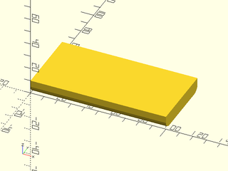

# LibFile: boardgame\_toolkit.scad

This file has all the modules needed to generate varioius inserts
for board games.  It makes the generation of the inserts simpler by
creating a number of useful base modules for making boxes and lids
of various types specific to board game inserts.  Specifically it
makes tabbed lids and sliding lids easily.

To use, add the following lines to the beginning of your file:

    include <boardgame_toolkit.scad>

## File Contents

1. [Section: BuildingBlocks](#section-buildingblocks)
    - [`RoundedBoxOnLengeth()`](#module-roundedboxonlengeth)

## Section: BuildingBlocks

Building blocks to make all the rest of the items from.  This has all the basic parts of the board game
toolkit for making polygons and laying them out.

### Module: RoundedBoxOnLengeth()

**Usage:** 

- RoundedBoxOnLength(100, 50, 10, 5);

**Description:** 

Creates a rounded box for use in the board game insert with a nice radius on two sides (length side).

**Arguments:** 

<abbr title="These args can be used by position or by name.">By&nbsp;Position</abbr> | What it does
-------------------- | ------------
`width`              | width of the cube
`length`             | of the cube
`height`             | of the cube
`radius`             | radius of the curve on the edges

**Example 1:** 

    include <boardgame_toolkit.scad>
    RoundedBoxOnLength(100, 50, 10, 5);

  

---

