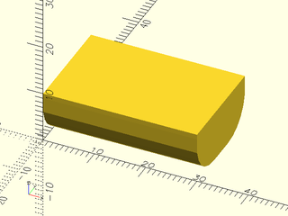
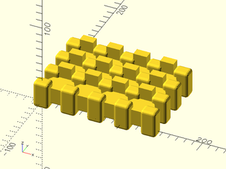

# LibFile: boardgame\_toolkit.scad

This file has all the modules needed to generate varioius inserts
for board games.  It makes the generation of the inserts simpler by
creating a number of useful base modules for making boxes and lids
of various types specific to board game inserts.  Specifically it
makes tabbed lids and sliding lids easily.

To use, add the following lines to the beginning of your file:

    include <boardgame_toolkit.scad>

## File Contents

- [`m_piece_wiggle_room`](#constant-m_piece_wiggle_room)

2. [Section: Components](#section-components)
    - [`RoundedBoxOnLengeth()`](#module-roundedboxonlengeth)
    - [`RoundedBoxAllSides()`](#module-roundedboxallsides)
    - [`RoundedBoxGrid()`](#module-roundedboxgrid)
    - [`RegularPolygon()`](#module-regularpolygon)
    - [`RegularPolygonGrid()`](#module-regularpolygongrid)
    - [`RegularPolygonGridDense()`](#module-regularpolygongriddense)
    - [`HexGridWithCutouts()`](#module-hexgridwithcutouts)

3. [Section: Labels](#section-labels)
    - [`MakeStripedGrid()`](#module-makestripedgrid)
    - [`MakeStripedLidLabel()`](#module-makestripedlidlabel)

4. [Section: Lid](#section-lid)
    - [`LidMeshHex()`](#module-lidmeshhex)
    - [`LidMeshRepeating()`](#module-lidmeshrepeating)
    - [`SlidingLidFingernail()`](#module-slidinglidfingernail)
    - [`MakeLidTab()`](#module-makelidtab)
    - [`MakeTabs()`](#module-maketabs)

5. [Section: SlidingBox](#section-slidingbox)
    - [`SlidingLid()`](#module-slidinglid)
    - [`SlidingBoxLidWithLabel`](#module-slidingboxlidwithlabel)
    - [`MakeHexBoxWithSlidingLid()`](#module-makehexboxwithslidinglid)
    - [`MakeBoxWithSlidingLid()`](#module-makeboxwithslidinglid)

6. [Section: TabbedBox](#section-tabbedbox)
    - [`MakeInsetLid()`](#module-makeinsetlid)
    - [`MakeTabbedInsetLid()`](#module-maketabbedinsetlid)
    - [`MakeBoxWithTabsInsetLid()`](#module-makeboxwithtabsinsetlid)
    - [`MakeHexBoxWithTabsInsetLid()`](#module-makehexboxwithtabsinsetlid)

### Constant: m\_piece\_wiggle\_room

**Description:** 

How many mm to use as gaps for when things join.

---

## Section: Components

Building blocks to make all the rest of the items from.  This has all the basic parts of the board game
toolkit for making polygons and laying them out.

### Module: RoundedBoxOnLengeth()

**Usage:** 

- RoundedBoxOnLength(100, 50, 10, 5);

**Description:** 

Creates a rounded box for use in the board game insert with a nice radius on two sides (length side).

**Arguments:** 

<abbr title="These args can be used by position or by name.">By&nbsp;Position</abbr> | What it does
-------------------- | ------------
`width`              | width of the cube
`length`             | of the cube
`height`             | of the cube
`radius`             | radius of the curve on the edges

**Example 1:** 

    include <boardgame_toolkit.scad>
    RoundedBoxOnLength(30, 20, 10, 7);

  

---

### Module: RoundedBoxAllSides()

**Usage:** 

- RoundedBoxAllSides(30,20,10,5);

**Description:** 

Creates a rounded box with all the sides rounded.

**Arguments:** 

<abbr title="These args can be used by position or by name.">By&nbsp;Position</abbr> | What it does
-------------------- | ------------
`width`              | width of the cube
`length`             | of the cube
`height`             | of the cube
`radius`             | radius of the curve on the edges

**Example 1:** 

    include <boardgame_toolkit.scad>
    RoundedBoxAllSides(30, 20, 10, 7);

  

---

### Module: RoundedBoxGrid()

**Usage:** 

- RoundedBoxGrid(20,20,10,5, rows=2, cols=1);

**Description:** 

Create a grid of rounded boxes, this is useful for inserting a number of containers inside a insert box.

**Arguments:** 

<abbr title="These args can be used by position or by name.">By&nbsp;Position</abbr> | What it does
-------------------- | ------------
`width`              | width of the space (total, inside will be divided by this)
`length`             | of the space (total, inside will be divided by this)
`height`             | of the space
`radius`             | radius of the curve on the edges
`rows`               | number of rows to generate
`cols`               | number of cols to generate
`spacing`            | number of mm between the spaces (default 2)
`all_sides`          | round all the sides (default false)

**Example 1:** 

    include <boardgame_toolkit.scad>
    RoundedBoxGrid(30, 20, 10, 7, rows=2, cols=1);

  

---

### Module: RegularPolygon()

**Usage:** 

- RegularPolygon(10, 5, 6);

**Description:** 

Creates a regular polygon with specific height/width and number of edges.

**Arguments:** 

<abbr title="These args can be used by position or by name.">By&nbsp;Position</abbr> | What it does
-------------------- | ------------
`width`              | total width of the piece, this is equivilant to the apothem of a polygon * 2
`height`             | how high to create the item
`shape_edges`        | number of edges for the polygon

**Example 1:** 

    include <boardgame_toolkit.scad>
    RegularPolygon(10, 5, shape_edges = 6);

  

---

### Module: RegularPolygonGrid()

**Usage:** 

- RegularPolygonGrid(10, 2, 1, 2)

**Description:** 

Lays out the grid with all the polygons as children.  The layout handles any shape as children.
This uses the exact width of the polygon to layout the underlying grid.  This just does all the
spacing, the actual generation is done using the children to this module.  This is usually used in
conjuction with [`RegularPolygon()`](#module-regularpolygon)

**Arguments:** 

<abbr title="These args can be used by position or by name.">By&nbsp;Position</abbr> | What it does
-------------------- | ------------
`width`              | total width of the piece, this is equivilant to the apothem of a polygon * 2
`rows`               | number of rows to generate
`cols`               | number of cols to generate
`spacing`            | spacing between shapres

**Example 1:** 

 

    include <boardgame_toolkit.scad>
    RegularPolygonGrid(width = 10, rows = 2, cols = 1, spacing = 2)
       RegularPolygon(width = 10, height = 5, shape_edges = 6);

---

### Module: RegularPolygonGridDense()

**Usage:** 

- RegularPolygonGridDense(10, 2, 1)

**Description:** 

Lays out the grid with all the polygons as children in a dense layout, this only works for triangles and hexes.
It will do a dense space filling using the spacing as the distance between the polygons.
This uses the exact width of the polygon to layout the underlying grid.  This just does all the
spacing, the actual generation is done using the children to this module.  This is usually used in
conjuction with [`RegularPolygon()`](#module-regularpolygon)

**Arguments:** 

<abbr title="These args can be used by position or by name.">By&nbsp;Position</abbr> | What it does
-------------------- | ------------
`width`              | total width of the piece, this is equivilant to the apothem of a polygon * 2
`rows`               | number of rows to generate
`cols`               | number of cols to generate
`spacing`            | spacing between shapres

**Example 1:** 

 

    include <boardgame_toolkit.scad>
    RegularPolygonGridDense(width = 10, rows = 3, cols = 2, spacing = 2)
       RegularPolygon(width = 10, height = 5, shape_edges = 6);

---

### Module: HexGridWithCutouts()

**Usage:** 

- HexGridWithCutouts(rows = 4, cols = 3, height = 10, spacing = 0, push_block_height = 1, tile_width = 29);

**Description:** 

This creates a hex grid with cutouts that can be used to cut out piece of a box to make a nice hex spacing
inside the box.

**Arguments:** 

<abbr title="These args can be used by position or by name.">By&nbsp;Position</abbr> | What it does
-------------------- | ------------
`rows`               | rows of the grid
`cols`               | colrs of the grid
`height`             | height of the grid
`spacing`            | space between the tiles
`tile_width`         | width of the tiles
`push_block_height`  | height of the pushblock to use (default 0)

**Example 1:** 

 

    include <boardgame_toolkit.scad>
    HexGridWithCutouts(rows = 4, cols = 3, height = 10, spacing = 0, push_block_height = 1, tile_width = 29);

---

## Section: Labels

Building blocks for making labels.

### Module: MakeStripedGrid()

**Usage:** 

- MakeStripedGrid(20,50);

**Description:** 

Creates a background striped grid, this is used in the label space generation.

**Arguments:** 

<abbr title="These args can be used by position or by name.">By&nbsp;Position</abbr> | What it does
-------------------- | ------------
`width`              | width of the grid space
`length`             | length of the grid space
`bar_width`          | width of the bars (default 1)

**Example 1:** 

    include <boardgame_toolkit.scad>
    MakeStripedGrid(20, 50);

  

---

### Module: MakeStripedLidLabel()

**Usage:** 

- MakeStripedLidLabel(20, 80, 2, label="Australia", border = 2, offset = 4);

**Description:** 

Makes a label inside a striped grid to use in the lid.  It makes a label with a border and a striped
grid in the background to keep the label in plave.

**Arguments:** 

<abbr title="These args can be used by position or by name.">By&nbsp;Position</abbr> | What it does
-------------------- | ------------
`width`              | width of the label section
`length`             | length of the label section
`lid_height`         | height of the lid/label
`label`              | the text of the label
`border`             | how wide the border is around the label (default 2)
`offset`             | how far in from the sides the text should be (default 4)
`font`               | the font to use for the text (default "Stencil Std:style=Bold")
`radius`             | the radius of the corners on the label section

**Example 1:** 

 

    include <boardgame_toolkit.scad>
    MakeStripedLidLabel(width = 20, length = 80, lid_height = 2, label = "Australia");

---

## Section: Lid

Building blocks for making various kinds of lids and labels.

### Module: LidMeshHex()

**Usage:** 

- LidMeshHex(width = 70, length = 50, lid_height = 3, boundary = 10, radius = 5, shape_thickness = 2);

**Description:** 

Make a hex mesh for the lid.  This makes a nice pattern for use on the lids.

**Arguments:** 

<abbr title="These args can be used by position or by name.">By&nbsp;Position</abbr> | What it does
-------------------- | ------------
`width`              | width of the mesh section
`length`             | the length of the mesh section
`lid_height`         | how high the lid is
`boundary`           | how wide of a boundary edge to put on the side of the lid
`radius`             | the radius of the polygon to create
`shape_thickness`    | how thick to generate the gaps between the hexes

**Example 1:** 

 

    include <boardgame_toolkit.scad>
    LidMeshHex(width = 100, length = 50, lid_height = 3, boundary = 10, radius = 10, shape_thickness = 2);

---

### Module: LidMeshRepeating()

**Usage:** 

- LidMeshRepeating(50, 20, 3, 5, 10);

**Description:** 

Make a mesh for the lid with a repeating shape.  It uses the children of this to repeat the shape.

**Arguments:** 

<abbr title="These args can be used by position or by name.">By&nbsp;Position</abbr> | What it does
-------------------- | ------------
`width`              | width of the mesh section
`length`             | the length of the mesh section
`lid_height`         | how high the lid is
`boundary`           | how wide of a boundary edge to put on the side of the lid
`shape_width`        | the width to use between each shape.

**Example 1:** 

 

    include <boardgame_toolkit.scad>
    LidMeshRepeating(width = 50, length = 50, lid_height = 3, boundary = 5, shape_width = 10)
       difference() {
         circle(r = 7);
         circle(r = 6);
       }

---

### Module: SlidingLidFingernail()

**Usage:** 

- SlidingLidFingernail(radius = 10, lid_height = 3);

**Description:** 

Creates a fingernail section for moving a sliding lid.

**Arguments:** 

<abbr title="These args can be used by position or by name.">By&nbsp;Position</abbr> | What it does
-------------------- | ------------
`radius`             | radius of the circle the gap is in
`lid_height`         | height of the lid
`finger_gap`         | the space to make for a finger gap (default = 1.5)
`sphere`             | the size of the sphere for the inset (default 12)
`finger_length`      | the length of the finger section (default = 15)

**Example 1:** 

    include <boardgame_toolkit.scad>
    SlidingLidFingernail(3);

  

---

### Module: MakeLidTab()

**Usage:** 

- MakeLidTab(5, 10, 2);

**Description:** 

Makes a lid tab, a single lid lab, to use for boxes.

**Arguments:** 

<abbr title="These args can be used by position or by name.">By&nbsp;Position</abbr> | What it does
-------------------- | ------------
`length`             | the length of the tab
`height`             | the height of the tab
`lid_height`         | the height of the lid (defaults to 2)
`prism_width`        | the width of the prism (defaults to 0.75)
`wall_thickness`     | the thickness of the walls (default 2)

**Example 1:** 

 

    include <boardgame_toolkit.scad>
    MakeLidTab(length = 5, height = 10, lid_height = 2, prism_width = 0.75, wall_thickness = 2);

---

### Module: MakeTabs()

**Usage:** 

- MakeTabs(50, 100, wall_thickness = 2, lid_height = 2);

**Description:** 

Create the tabs for the box, this can be used on the lids and the box to create cutouts,
this just does the layout. Use the [`MakeLidTab()`](#module-makelidtab) to make the tabs, it will place the children
at each of the specified offsets to make the tabs.

**Arguments:** 

<abbr title="These args can be used by position or by name.">By&nbsp;Position</abbr> | What it does
-------------------- | ------------
`box_width`          | width of the box (outside size)
`box_length`         | length of the box (outside size)
`wall_thickness`     | thickness of the walls to use (default = 2)
`lid_height`         | the height of the lid (default = 2)
`tab_length`         | how long the tab is (default = 10)
`make_tab_width`     | make tabs on the width side (default false)
`make_tab_length`    | make tabs on the length side (default true)
`prism_width`        | width of the prism to take from the side of the box (default 0.75)

**Example 1:** 

    include <boardgame_toolkit.scad>
    MakeTabs(50, 100)
      MakeLidTab(length = 10, height = 6);

  

---

## Section: SlidingBox

All the pieces for making sliding lids and different types of sliding lids/boxes.

### Module: SlidingLid()

**Usage:** 

- SlidingLid(width=10, length=30, lid_height=3, wall_thickness = 2, lid_size_spacing = 0.2);

**Description:** 

Creates a sliding lid for a sliding lid box, the children to this module are inserted into the lid.
This does all the right things on the edges, uses some
wiggle room to add in a buffer and also does a small amount of angling on the ends to make them easier
to insert.

**Arguments:** 

<abbr title="These args can be used by position or by name.">By&nbsp;Position</abbr> | What it does
-------------------- | ------------
`width`              | the width of the box itself
`length`             | the length of the box itself
`lid_height`         | the height of the lid (defaults to 3)
`wall_thickness`     | how wide the side walls are (defaults to 2)
`lid_size_spacing`   | how much of an offset to use in generate the slides spacing on all four sides defaults to
`[`m_piece_wiggle_room`](#constant-m_piece_wiggle_room)`

**Example 1:** 

 

    include <boardgame_toolkit.scad>
    SlidingLid(width=100, length=100, lid_height=3, wall_thickness = 2)
      translate([ 10, 10, 0 ])
        LidMeshHex(width = 100, length = 100, lid_height = 3, boundary = 10, radius = 12);

---

### Module: SlidingBoxLidWithLabel

**Usage:** 

- SlidingBoxLidWithLabel(
-     width = 100, length = 100, lid_height = 3, text_width = 60,
-     text_length = 30, text_str = "Trains", label_rotated = false);

**Description:** 

This is a composite method that joins together the other pieces to make a simple lid with a label and a hex grid.
The children to this as also pulled out of the lid so can be used to build more complicated lids.

**Arguments:** 

<abbr title="These args can be used by position or by name.">By&nbsp;Position</abbr> | What it does
-------------------- | ------------
`width`              | width of the box (outside dimension)
`length`             | length of the box (outside dimension)
`lid_height`         | height of the lid
`text_width`         | width of the text section
`text_length`        | length of the text section
`text_str`           | The string to write
`lid_boundary`       | how much boundary should be around the pattern (default 10)
`label_radius`       | radius of the rounded corner for the label section (default 12)
`border`             | how wide the border strip on the label should be (default 2)
`offset`             | how far inside the border the label should be (degault 4)
`label_rotated`      | if the label should be rotated, default to false

**Example 1:** 

 

    include <boardgame_toolkit.scad>
    SlidingBoxLidWithLabel(
        width = 100, length = 100, lid_height = 3, text_width = 60,
        text_length = 30, text_str = "Trains", label_rotated = false);

---

### Module: MakeHexBoxWithSlidingLid()

**Usage:** 

- MakeHexBoxWithSlidingLid(5, 7, 19, 1, 29);

**Description:** 

Creates a box with a specific number of hex spaces given the rows/cols and width of the pieces.  Useful
for making 18xx style boxes quickly.  Children to this are the same as children to the MakeBoxWithSlidingLid.

This will make
sure the cutouts are only inside the box and in the floor, if you want to cut out the sides of the box
do this with a difference after making this object.

**Arguments:** 

<abbr title="These args can be used by position or by name.">By&nbsp;Position</abbr> | What it does
-------------------- | ------------
`rows`               | number of rows to generate
`cols`               | number of cols to generate
`height`             | height of the box itsdle (outside height)
`push_block_height`  | height of the raised bit in the middle to make removing easier
`lid_height`         | height of the lid (defaults to 3)
`wall_thickness`     | thickness of the walls (defaults to 2)
`spacing`            | spacing between the hexes

**Example 1:** 

 

    include <boardgame_toolkit.scad>
    MakeHexBoxWithSlidingLid(rows = 5, cols = 2, height = 10, push_block_height = 0.75, tile_width = 29);

---

### Module: MakeBoxWithSlidingLid()

**Usage:** 

- MakeBoxWithSlidingLid(50,100,20);

**Description:** 

Makes a box with a sliding lid, this just creates the box itself with the cutouts for the
sliding lid pieces.  The children to this will be removed from inside the box and how to add
in the cutouts.

This will make
sure the cutouts are only inside the box and in the floor, if you want to cut out the sides of the box
do this with a difference after making this object.

**Arguments:** 

<abbr title="These args can be used by position or by name.">By&nbsp;Position</abbr> | What it does
-------------------- | ------------
`width`              | width of the box (outside width)
`length`             | length of the box (outside length)
`height`             | height of the box (outside height)
`wall_thickness`     | thickness of the walls (default 2)
`lid_height`         | height of the lid (default 3)

**Example 1:** 

    include <boardgame_toolkit.scad>
    MakeBoxWithSlidingLid(50, 100, 20);

  

---

## Section: TabbedBox

### Module: MakeInsetLid()

**Usage:** 

- MakeInsetLid(50, 100);

**Description:** 

Make a lid inset into the box with tabs on the side to close the box.  This just does the insets around the top.

**Arguments:** 

<abbr title="These args can be used by position or by name.">By&nbsp;Position</abbr> | What it does
-------------------- | ------------
`width`              | the width of the box (outside width)
`length`             | the length of the box (outside length)
`lid_height`         | height of the lid (default 2)
`wall_thickness`     | thickness of the walls (default 2)
`inset`              | how far the side is inset from the edge of the box (default 1)
`lid_size_spacing`   | how much wiggle room to give in the model (default [`m_piece_wiggle_room`](#constant-m_piece_wiggle_room))

**Example 1:** 

    include <boardgame_toolkit.scad>
    MakeInsetLid(50, 100);

  

---

### Module: MakeTabbedInsetLid()

**Usage:** 

- MakeTabbedInsetLid(30, 100);

**Description:** 

Makes an inset lid with the tabes on the side.

**Arguments:** 

<abbr title="These args can be used by position or by name.">By&nbsp;Position</abbr> | What it does
-------------------- | ------------
`width`              | width of the box (outside width)
`length`             | length of the box (outside length)
`lid_height`         | height of the lid (default 2)
`wall_thickness`     | thickness of the walls (default 2)
`inset`              | how far to inset the lid (default 1)
`lid_size_spacing`   | the wiggle room in the lid generation (default [`m_piece_wiggle_room`](#constant-m_piece_wiggle_room))
`make_tab_width`     | makes tabes on thr width (default false)
`make_tab_length`    | makes tabs on the length (default true)
`prism_width`        | width of the prism in the tab. (default 0.75)
`tab_length`         | length of the tab (default 10)
`tab_height`         | height of the tab (default 6)

**Example 1:** 

    include <boardgame_toolkit.scad>
    MakeTabbedInsetLid(30, 100);

  

---

### Module: MakeBoxWithTabsInsetLid()

**Usage:** 

- MakeBoxWithTabsInsetLid(width = 30, length = 100, height = 20);

**Description:** 

Makes a box with an inset lid.  Handles all the various pieces for making this with tabs.  This will make
sure the cutouts are only inside the box and in the floor, if you want to cut out the sides of the box
do this with a difference after making this object.

**Arguments:** 

<abbr title="These args can be used by position or by name.">By&nbsp;Position</abbr> | What it does
-------------------- | ------------
`width`              | width of the box (outside width)
`length`             | length of the box (outside length)
`height`             | height of the box (outside height)
`wall_thickness`     | how thick the walls are (default 2)
`lid_height`         | how hight the lid is (default 2)
`tab_height`         | how heigh to make the tabs (default 6)
`inset`              | how far to inset the lid (default 1)
`make_tab_width`     | make the tabs on the width (default false)
`make_tab_length`    | make the tabs on the length (default true)
`prism_width`        | width of the prism to generate (default 0.75)
`tab_length`         | how long the tab is (default 10)
`stackable`          | should we pull a piece out the bottom of the box to let this stack (default false)
`lid_size_spacing`   | wiggle room to use when generatiung box (default [`m_piece_wiggle_room`](#constant-m_piece_wiggle_room))

**Example 1:** 

 

    include <boardgame_toolkit.scad>
    MakeBoxWithTabsInsetLid(width = 30, length = 100, height = 20);

---

### Module: MakeHexBoxWithTabsInsetLid()

**Usage:** 

- MakeHexBoxWithTabsInsetLid(rows = 4, cols = 3, height = 15, push_block_height = 1, tile_width = 29);

**Description:** 

Makes a hex box with an inset lid, this is a useful combination box for 18xx style games.

**Arguments:** 

<abbr title="These args can be used by position or by name.">By&nbsp;Position</abbr> | What it does
-------------------- | ------------
`rows`               | number of rows in the box
`cols`               | number of cols in the box
`height`             | height of the box (outside height)
`push_block_height`  | height of the push blocks
`tile_width`         | the width of the files
`lid_height`         | height of the lid (default 2)

**Example 1:** 

 

    include <boardgame_toolkit.scad>
    MakeHexBoxWithTabsInsetLid(rows = 4, cols = 3, height = 15, push_block_height = 1, tile_width = 29);

---

